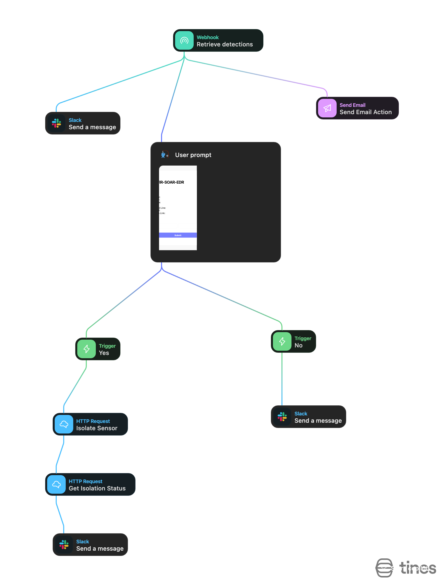

# SOAR-Driven EDR Credential Theft Detection

## Overview
This project demonstrates a SOAR-driven EDR workflow that detects credential harvesting activity on a Linux endpoint and automatically contains the threat.

The solution uses LimaCharlie for endpoint detection, Tines for automated response, and Slack for real-time alerting.

## Screenshots 

### LimaCharlie Detection Alert
This screenshot shows the custom LimaCharlie EDR detection firing when LaZagne is executed on a Linux endpoint.

[View LimaCharlie Detection Screenshot](screenshots/LimaCharlie detection of laZagne.pdf)

### Tines SOAR Workflow – Automated Response
This screenshot shows the Tines playbook that receives the LimaCharlie alert and automatically isolates the affected endpoint.

### Slack Alert – Detection Without Isolation
This screenshot shows the Slack alert generated when the LimaCharlie detection fired, but the endpoint was not isolated.

[View Slack Alert – No Isolation (PDF)](screenshots/Slack message when the user presses no.pdf)

### Slack Alert – Endpoint Successfully Isolated
This screenshot shows the Slack notification confirming that the affected Linux endpoint was successfully isolated following the detection.

[View Slack Alert – Isolation Successful (PDF)](screenshots/Slack message when user presses yes.pdf)
